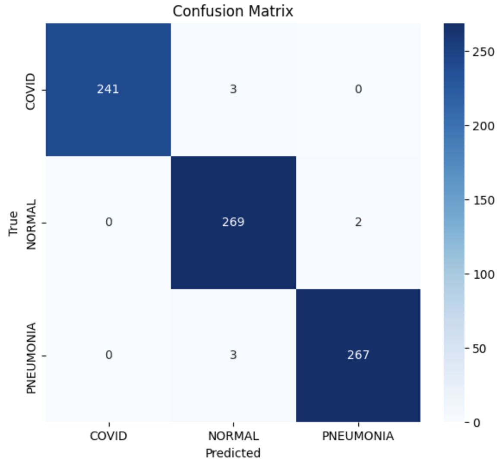
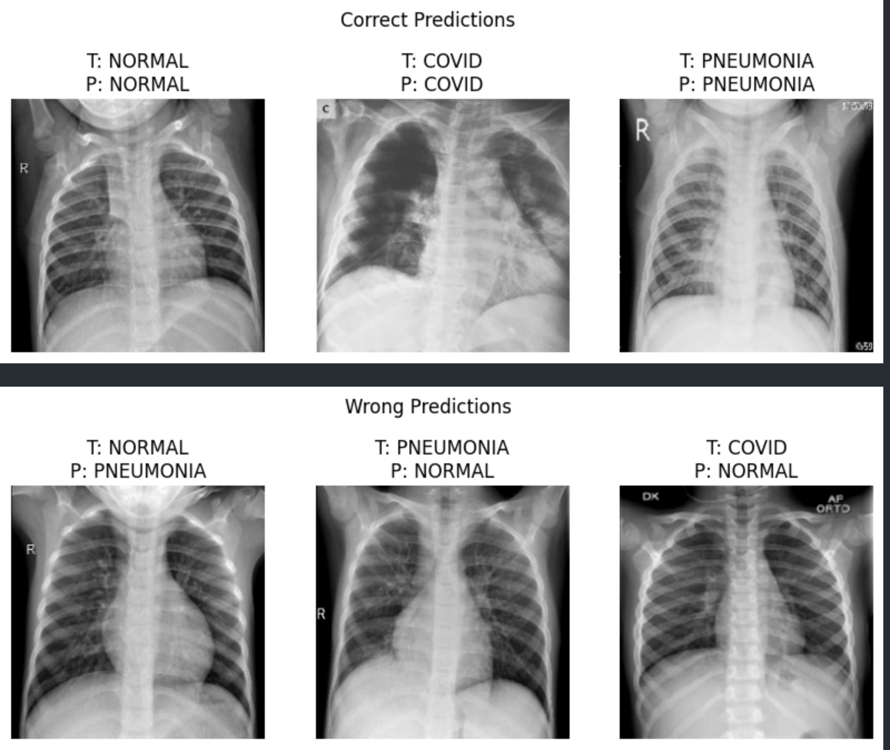
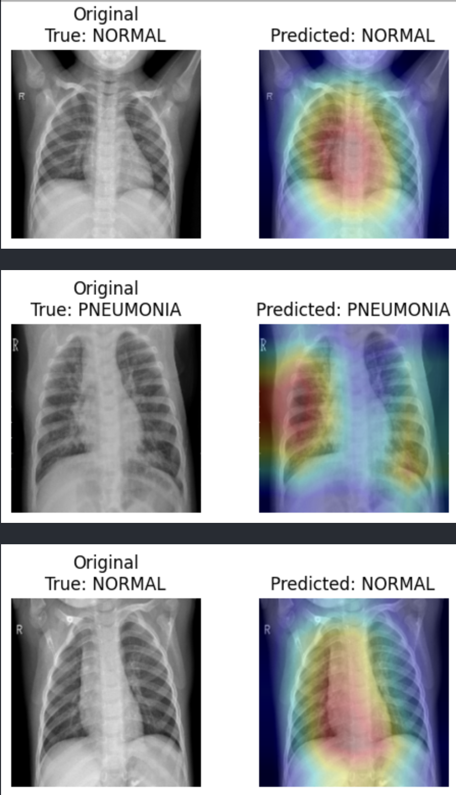

# CXR-CLS

Automated chest X-ray classification using ResNet18 with Grad-CAM interpretability for COVID-19, Pneumonia, and Normal cases.

---

# Overview

CXR-CLS is a deep learning framework designed for automated multi-class chest X-ray classification. The project focuses on detecting and distinguishing between COVID-19, Pneumonia, and Normal chest X-rays using convolutional neural networks.

The pipeline is implemented in PyTorch and leverages transfer learning with a pretrained ResNet18 backbone to achieve robust classification performance on medical imaging data.

Unlike conventional image classification pipelines, CXR-CLS integrates both diagnostic prediction and model interpretability. In addition to classification, the framework includes Grad-CAM visualization to highlight image regions that contribute most strongly to the model’s predictions, enabling a more explainable AI workflow for medical image analysis.

The framework includes preprocessing, augmentation, training, evaluation, visualization utilities, and checkpoint saving for reproducible experimentation and deployment-ready workflows.

CXR-CLS has been evaluated on labeled chest X-ray datasets containing COVID-19, Pneumonia, and Normal samples, demonstrating strong performance and reliable generalization across all classes.

---

# Features

## Chest X-Ray Preprocessing

Input chest X-ray images are resized and normalized using ImageNet statistics for compatibility with pretrained CNN architectures.

The preprocessing pipeline includes:

- Image resizing
- Grayscale-to-RGB conversion
- Tensor normalization
- Validation/test standardization

These preprocessing operations ensure stable training behavior and consistent input representation across all dataset splits.

---

## Data Augmentation

To improve generalization and reduce overfitting, multiple augmentation techniques are applied during training.

The augmentation pipeline includes:

- Random rotations
- Random affine transformations
- Small translations
- Scaling augmentation

These augmentations help the model learn robust radiological features under varying image conditions and improve performance on unseen data.

---

## ResNet18 Classification Architecture

CXR-CLS uses a pretrained ResNet18 backbone initialized with ImageNet weights.

The final fully connected layer is replaced to support multi-class chest X-ray classification:

- COVID
- NORMAL
- PNEUMONIA

Transfer learning significantly improves convergence speed and overall classification performance on limited medical imaging datasets.

---

## Mixed Precision Training

The training pipeline supports automatic mixed precision (AMP) for faster computation and lower GPU memory usage.

Benefits include:

- Faster training
- Reduced memory consumption
- Efficient GPU utilization

Mixed precision training enables more efficient experimentation while maintaining numerical stability during optimization.

---

## Early Stopping & Learning Rate Scheduling

To stabilize training and reduce overfitting, the framework integrates:

- Early stopping
- ReduceLROnPlateau scheduler

The learning rate automatically decreases when validation loss plateaus, helping the model converge more effectively during training.

---

## Evaluation Metrics

The framework provides comprehensive evaluation metrics to assess classification performance across all chest X-ray categories.

The reported metrics include:

- Accuracy
- Precision
- Recall
- F1-score
- ROC-AUC score
- Confusion matrix
- Full classification report

These metrics provide both global and class-wise performance analysis, enabling reliable evaluation of diagnostic capability and model generalization.

---

## Visualization Utilities

CXR-CLS includes visualization modules for qualitative model evaluation and explainability analysis.

### Prediction Visualization

The framework visualizes:

- Correctly classified samples
- Incorrectly classified samples
- Random test predictions

These visualizations help analyze prediction quality and identify challenging image cases.

### Grad-CAM Explainability

Grad-CAM heatmaps are generated to visualize regions of the chest X-ray that most strongly influence the model’s predictions.

This enables interpretable deep learning analysis and provides insight into learned pathological features, improving transparency in the decision-making process.

---

## Model Checkpoint Support

The project supports saving trained model checkpoints for:

- Model reuse
- Inference
- Fine-tuning
- Continued training
- Reproducibility

Trained checkpoints can be found inside:

```text
models/checkpoints/
```

The checkpoint file stores trained model weights, optimizer state, and class labels required for inference or continued training.

This allows the model to be reused without retraining from scratch and enables reproducible experimentation across environments.

---

# Dataset

The framework expects chest X-ray images organized by class folders.

Example structure:

```text
dataset/
│
├── COVID/
├── NORMAL/
└── PNEUMONIA/
```

Each folder should contain corresponding chest X-ray images for that category.

The project is designed for supervised multi-class classification of chest radiographs and supports standard image-based datasets commonly used in medical imaging research.

---

# Dataset Split

The dataset is automatically divided into:

- 70% Training
- 15% Validation
- 15% Testing

Stratified splitting is used to preserve class balance across all subsets and ensure fair evaluation.

---

# Training Pipeline

The complete training workflow includes:

- Dataset loading
- Data augmentation
- Transfer learning
- Mixed precision training
- Validation monitoring
- Early stopping
- Learning rate scheduling
- Final evaluation
- Visualization generation
- Grad-CAM explainability
- Checkpoint saving

The modular pipeline design allows easy experimentation and extension to additional chest disease categories or alternative CNN architectures.

---

# Performance

The final model achieved the following performance on the test dataset:

```text
Accuracy : 0.9898
Precision: 0.9902
Recall   : 0.9897
F1 Score : 0.9900
ROC-AUC  : 0.9998
```

Classification Report:

```text
              precision    recall  f1-score   support

       COVID       1.00      0.99      0.99       244
      NORMAL       0.98      0.99      0.99       271
   PNEUMONIA       0.99      0.99      0.99       270

    accuracy                           0.99       785
   macro avg       0.99      0.99      0.99       785
weighted avg       0.99      0.99      0.99       785
```

The model demonstrates strong classification performance across all chest X-ray categories with high ROC-AUC and balanced precision-recall behavior.

---

# Requirements

The following libraries are required:

```text
Python >= 3.9
torch
torchvision
numpy
pandas
matplotlib
scikit-learn
opencv-python
seaborn
tqdm
Pillow
```

Install dependencies via:

```bash
pip install -r requirements.txt
```

---

# Checkpoints

Pretrained model checkpoints are provided inside:

```text
models/checkpoints/
```

The checkpoint file contains:

- Trained model weights
- Optimizer state
- Class labels

This allows easy inference or continued training without retraining the entire model from scratch.

---

# Visualization

To improve interpretability and qualitative evaluation, the project includes multiple visualization utilities for inspecting model behavior and prediction quality.

The visualization module includes:

- Confusion matrix visualization
- Correct vs incorrect prediction visualization
- Grad-CAM heatmaps
- Overlay explainability maps

Example visual outputs can be found inside:

```text
assets/visualizations/
```

### Confusion Matrix

<p align="center">
  
</p>

_Shows the classification performance for each class._

### Prediction Visualization

<p align="center">
  
</p>

_Displays correctly and incorrectly classified samples._

### Grad-CAM Visualization

<p align="center">
  
</p>

Highlights regions in the X-ray that most influence the model’s prediction.

---

# Notes

- The project supports CUDA, Apple Silicon (MPS), and CPU execution.
- Mixed precision training is automatically enabled on CUDA devices.
- Grad-CAM is implemented using forward and backward hooks on the final convolutional layer of ResNet18.
- The framework is modular and can be extended to additional chest disease categories.

---

## Trained Model Checkpoint

The trained ResNet18 model checkpoint is provided in the `checkpoints/` directory.

Checkpoint file:
- `xray_resnet18_checkpoint.ckpt`

The checkpoint contains:
- Model weights
- Optimizer state
- Class labels

This allows the trained model to be reloaded for inference, evaluation, or further fine-tuning without retraining from scratch.

--- 

# License

This project is intended for research and educational purposes.
